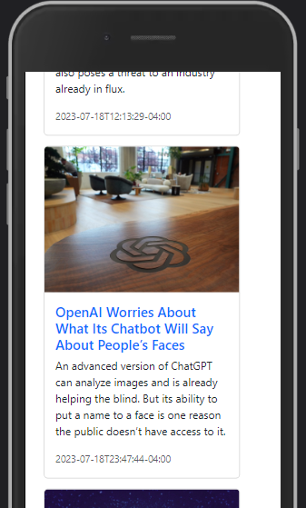

# JavaScript-Fetch-API

Hi,

Within the scope of this course, I learned web technologies and improved myself by working on practical projects. During the course, I learned how to create basic web pages with HTML and CSS, add interactive features with JavaScript, and apply responsive design principles.

<h1>Images</h1>

 
